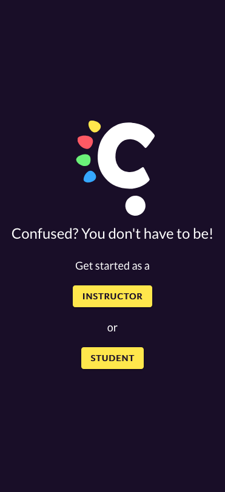
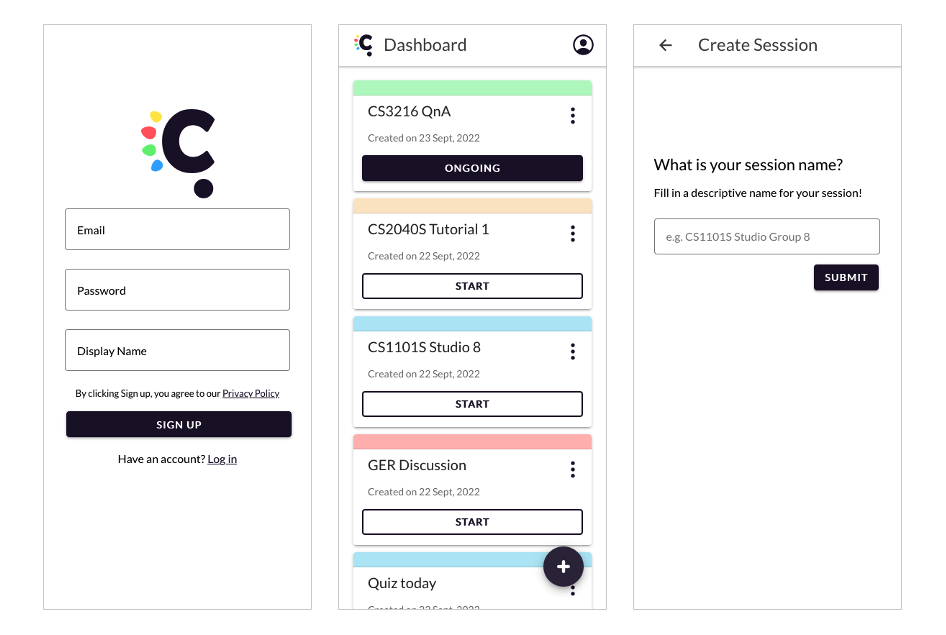
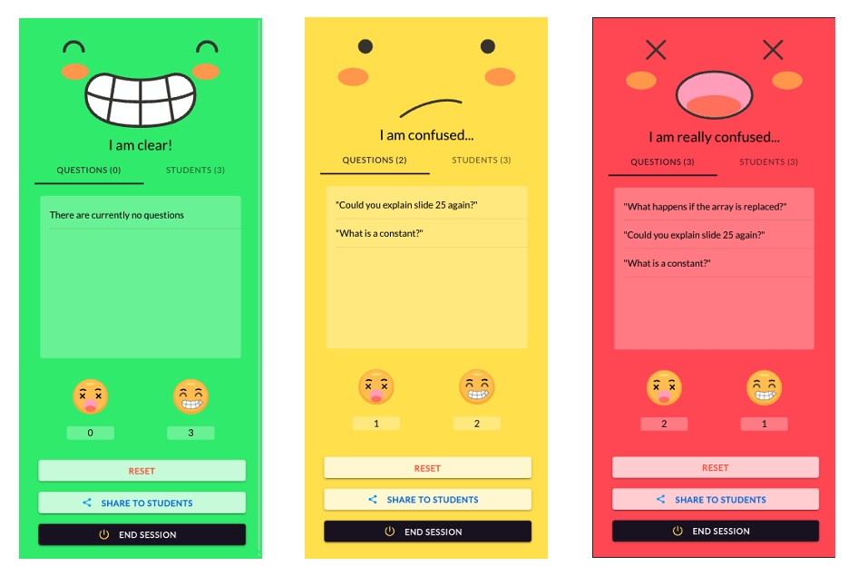
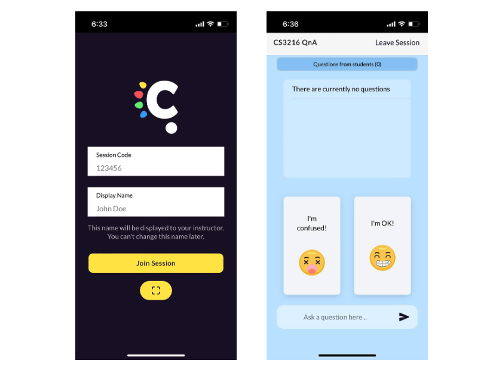

<p align="center"></p>
<h1 align="center">Confused</h1>
<h3 align='center'>Real Time Student Feedback Progressive Web App</h3>
<p align='center'>AY22/23 CS3216 Assignment 3</p>
<p align="center"><a href="https://confusedsession.vercel.app">Give it a try now!</a></p>

## Table of Contents

1. [Overview](#overview)
2. [Team Members](#team-members)
3. [Submission](#submission)
4. [User Guide](#user-guide)
   - [Instructor](#instructor)
   - [Student](#student)
5. [Development Guide](#development-guide)

## Overview

Confused is a Progressive Web App (PWA) designed to help students give instructors real time feedback. It is traditionally uneasy for shy students to raise concerns in the public in big classrooms, so Confused is here to help reduce the mental barriers for students to say "I'm confused" during lessons.

On our app, instructors could create, start and share sessions using session code or QR code. They could easily keep track of students' reactions and questions in a session.

Whenever students feel confused during a session, they could simply tap the reaction "I'm confused" to give instructors instantaneously feedback. They are also encouraged to send questions to give instructors more hints of what they are confused about!

Feel free to give it a try at: https://confusedsession.vercel.app

## Team Members

Members of CS3216 Assignment 3 Group 6:

| Name                | Contribution         |
| ------------------- | -------------------- |
| Ne Zhijian, Didymus | Full Stack Developer |
| Duan Yu Hang        | Frontend Developer   |
| Hong Ai Ling        | Frontend Developer   |
| Toh Kar Wi          | Backend Developer    |
| Zhang Ziqing        | Frontend Developer   |

## Submission

The following files are in `submission` folder:

- [group-6-milestones.pdf](submission/group-6-milestones.pdf)
- [group-6-pitch.pdf](submission/group-6-pitch.pdf)
- [group-6-lighthouse.html](submission/group-6-lighthouse.html)

## User Guide

Choose to join as instructor or student upon landing at this page:

<p align="center"></p>

### Instructor

1. Sign Up or Log in as an instructor using email

2. View Session and Create a Session

Upon logging in, you can view the list of sessions and edit them. If you want to create a new session, click on the "+" button at the bottom right corner

<p align="center"></p>

3. Start a Session

Press the "START" button to start a session. Now you can share the session for your students to join!

4. In a Session

Your page color will trun yellow then red as more students become confused. Meanwhlie if fewer students are confused, the screen will return to green eventually. Press "RESET" to reset reaction counts on the screen.

<p align="center"></p>

5. End Session

Press "End Session" to end the session and return to dashboard.

### Student

1. Join Session

Join a session by clicking a shared link, keying in the session code or scanning QR code shared by instructors. Add a nickname to continue. Rest assured that your activities will be kept anonymous to everyone.

2. In a Session

When you are confused, do not hesitate to press "I'm confused" so that your instructor will know immediately. You can also unselect "I'm confused" or press "I'm OK". You can also ask a specific question if you feel a single reaction is not enough.

<p align="center"></p>

3. Leave Session

Click on "Leave Session" on the top left bar to leave the session.

## Development Guide

To run this application locally, first clone this repository.

```
git clone https://github.com/cs3216/2022-a3-2022-a3-group-6.git
```

Then follow the instructions for backend and frontend:

### Backend

The backend is built using Python, Django and PostgreSQL: [Backend Development Guide](confused-backend/README.md)

### Frontend

The frontend is built using Ionic, React and TypeScript: [Frontend Development Guide](frontend/README.md)
